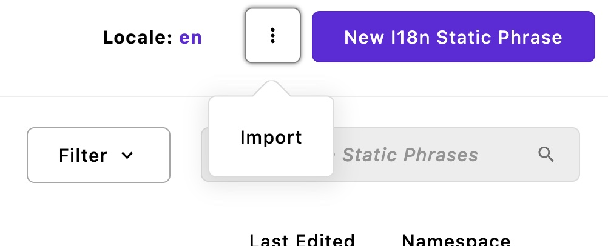
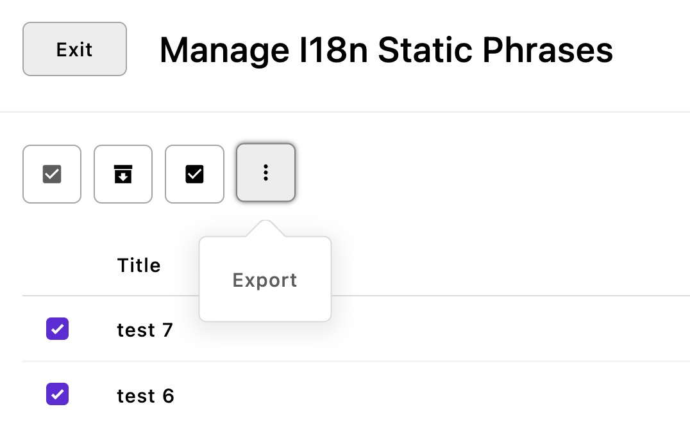

<a id="contents"></a>

# i18n-static
Edit translations of static text with i18next

1. [Installation](#1)<br>
2. [Configuration](#2)<br>
3. [Behavior](#3)<br>
4. [Import and export](#4)<br>

This module makes it possible to edit the [translations of static text strings found in templates](https://v3.docs.apostrophecms.org/guide/localization/static.html) through the ApostropheCMS admin UI.

> This module is intended to localize static text in templates i.e text wrapped with `__("...")`, **not localize editable content.** If your goal is content localization, you should use the [default localization feature in A3](https://v3.docs.apostrophecms.org/guide/localization/) instead.

---

JSON files used in Apostrophe are used by i18next. These resources are automatically converted as pieces through this module.

This will add an entry in the admin bar "i18n Static Phrases".

Only admin users have access to this module for now.

<a id="1"></a>

## 1 Installation [&#x2B06;](#contents)

Install the module with `npm i @apostrophecms/i18n-static` then declare it in the modules configuration in `app.js`:

```js
  modules: {
    '@apostrophecms/i18n-static': {},
  }
```

<a id="2"></a>


## 2 Configuration [&#x2B06;](#contents)

The locales configuration comes from the i18n module in a A3 project. Usually, in `modules/@apostrophecms/i18n/index.js`. Example:

```js
module.exports = {
  options: {
    defaultLocale: 'en',
    locales: {
      en: { label: 'English' },
      fr: {
        label: 'French',
        prefix: '/fr'
      },
      sk: {
        label: 'Slovak',
        prefix: '/sk'
      },
      es: {
        label: 'Spanish',
        prefix: '/es'
      },
      'pt-BR': {
        label: 'Portuguese',
        prefix: '/pt'
      },
      ar: {
        label: 'Arabic',
        prefix: '/ar'
      }
    }
  }
};
```

Namespaces group static texts. But if resources related to a specific namespace should not be created, it has to be excluded by configuring the array `excludeNamespaces` in the module's options.

```js
  modules: {
    '@apostrophecms/i18n-static': {
      options: {
        excludeNamespaces: [ 'aposEvent', 'aposForm' ]
      }
    },
  }
```

As the `autopublish` option is set to `true` by default, new pieces will be created as draft and live. Change this option to `false` if `draft` is necessary before publishing them later (the `publish` batch feature will be helpful in this case).

<a id="3"></a>

## 3 Behavior [&#x2B06;](#contents)

Pieces are automatically created based on i18next resources present in the A3 project. They can also be imported as explained in [the following section](#4).

When an i18n-static piece is edited, an ID is generated and stored in the `global` object. If multiple A3 instances are connected to the same database, they may not see the latest ID until the next request. When the global one changes, they will detect it and add the missing resource to i18next.

<a id="4"></a>

## 4 Import and export [&#x2B06;](#contents)

It is possible to import and export pieces through existing A3 modules: `npm i @apostrophecms/piece-type-exporter @apostrophecms/piece-type-importer`

These options must be added to the module's options at project level:

```js
  // in app.js
  modules: {
    ...
    '@apostrophecms/piece-type-exporter': {},
    '@apostrophecms/piece-type-importer': {},
    '@apostrophecms/i18n-static': {
      options: {
        export: true,
        import: true
      }
    }
  }
```

The import feature is then available in the manager modal: 

As the [piece-type-importer plugin](https://github.com/apostrophecms/piece-type-importer) is used, the CSV file used for import must include column names that match exactly the field names (optional empty column names can be excluded).

Example of a CSV:

```
title,namespace,valueSingular,valuePlural,valueZero
test 1,default,test singular,test plural,test zero
test 2,apostrophe,test,,
```

Pieces can also be updated with the update feature from the plugin, [as explained here](https://github.com/apostrophecms/piece-type-importer#updating-existing-pieces).

The export feature is available in the context menu when items are selected for import. 

[The piece-type-exporter plugin](https://github.com/apostrophecms/piece-type-exporter) is used, so it will generate a CSV file following the same type of structure used for the importer plugin.
