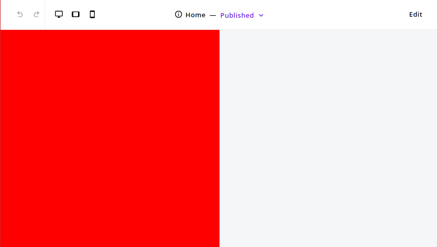
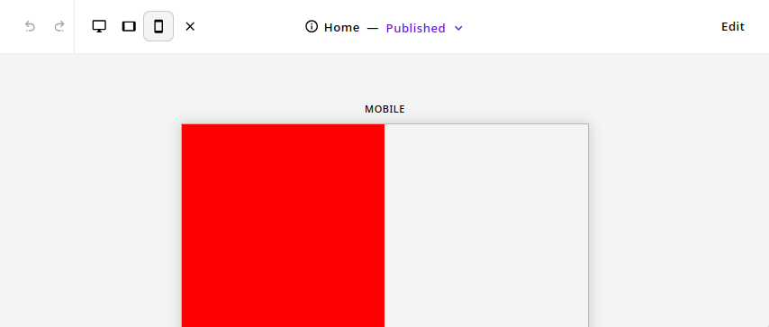

# postcss-viewport-to-container-toggle 

A plugin for [PostCSS](https://github.com/postcss/postcss) that allows to toggle between viewport and container units based on the presence of a container data attribute.

## Why?

This plugin has been originally developed to allow mobile preview without using any `iframe` in order to be as close as possible to the real rendering.

For examples, let's say we have a block in our page that is taking `50vw`. 
We want in the case of the mobile preview (where body is a container), this block to take `50cqw` instead of `50vw`.

Here is what it looks like, in normal mode, our block takes `50vw` as it did before we the initial code:



In mobile preview, body being a container, this block will take `50cqw` of the container:




## Demo

This css:

```css
.hello {
    width: 100vw;
    height: 100vh;
}
```

If you set the `modifierAttr` to `data-breakpoint-preview-mode` and `containerEl` to `body` (default), it'll be converted this way:

```css
.hello {
    width: 100vw;
    height: 100vh;
}

:where(body[data-breakpoint-preview-mode]) .hello {
    width: 100cqw;
    height: 100cqh;
}
```

The purpose being here to keep the existing behavior but to make the code work compatible for containers when body is in container mode.

Here is another examples with media queries:

```css
@media only screen and (width > 600px) and (max-width: 1000px) {
  .hello {
    top: 0;
    width: 100vw;
    height: calc(100vh - 50px);
  }
  .goodbye {
    width: 100%;
    color: #fff;
    transform: translateX(20vw);
  }
}

.toto {
  width: 100vh;
  color: white;
}
```


will become:

```css
@media only screen and (width > 600px) and (max-width: 1000px) {
  :where(body:not([data-breakpoint-preview-mode])) .hello {
    top: 0;
    width: 100vw;
    height: calc(100vh - 50px);
  }
  :where(body:not([data-breakpoint-preview-mode])) .goodbye {
    width: 100%;
    color: #fff;
    transform: translateX(20vw);
  }
}

@container (width > 600px) and (max-width: 1000px) {
  .hello {
    top: 0;
    width: 100cqw;
    height: calc(100cqh - 50px);
  }
  .goodbye {
    width: 100%;
    color: #fff;
    transform: translateX(20cqw);
  }
}

.toto {
  width: 100vh;
  color: white;
}

:where(body[data-breakpoint-preview-mode]) .toto {
  width: 100cqh;
}
```

As you can see, if body has no specific attribute, the behavior stays the same. 
When adding `data-breakpoint-preview-mode`, data in media queries are converted to container units and moved to container queries.

## Installation

```bash
npm install postcss-viewport-to-container-toggle
```

## Getting started

### Webpack

```javascript
const postcssViewportToContainerToggle = require('postcss-viewport-to-container-toggle');

{
  loader: 'postcss-loader',
  options: {
    sourceMap: true,
    postcssOptions: {
      plugins: [
        [
          postcssViewportToContainerToggle({
            modifierAttr: 'data-breakpoint-preview-mode',
            containerEl: 'body',
            debug: false
          }),
          'autoprefixer'
        ]
      ]
    }
  }
}
```

### Vite

```javascript
const postcssViewportToContainerToggle = require('postcss-viewport-to-container-toggle');

{
    css: {
      postcss: {
        plugins: [
          postcssViewportToContainerToggle({
            modifierAttr: 'data-breakpoint-preview-mode',
            containerEl: 'body',
            debug: false
          })
        ]
      }
    }
}
```

### Options

* `modifierAttr`: The attribute that will be used to toggle between viewport and container units.
* `containerEl`: The element that will be used as container. Default: `body`
* `debug`: If set to `true`, will output debug information. Default: `false`
* `transform`: A function that will be called for each media query, allowing to modify its params when creating the `container`.
